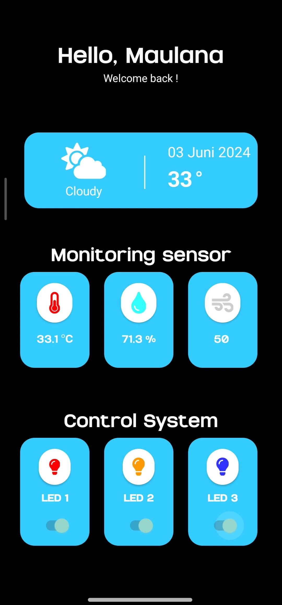
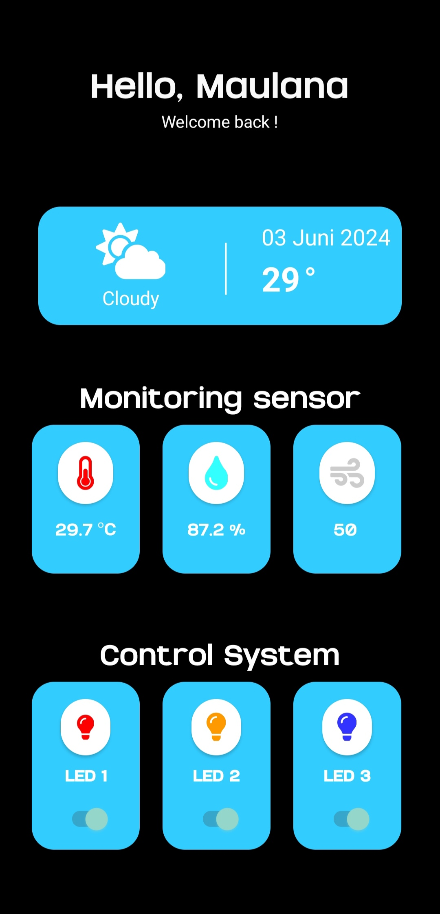
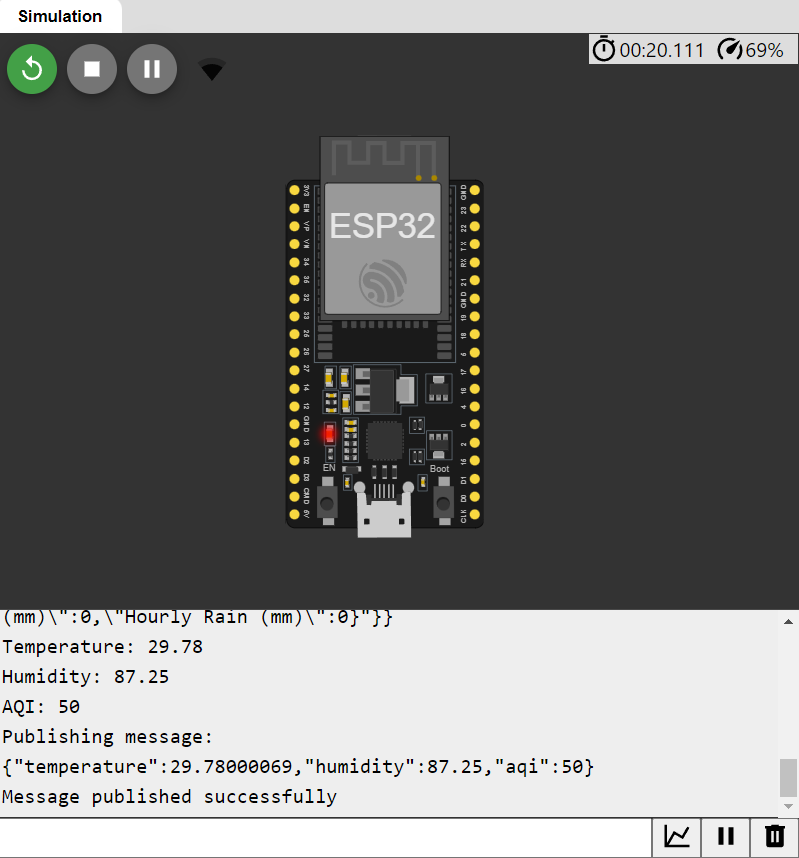
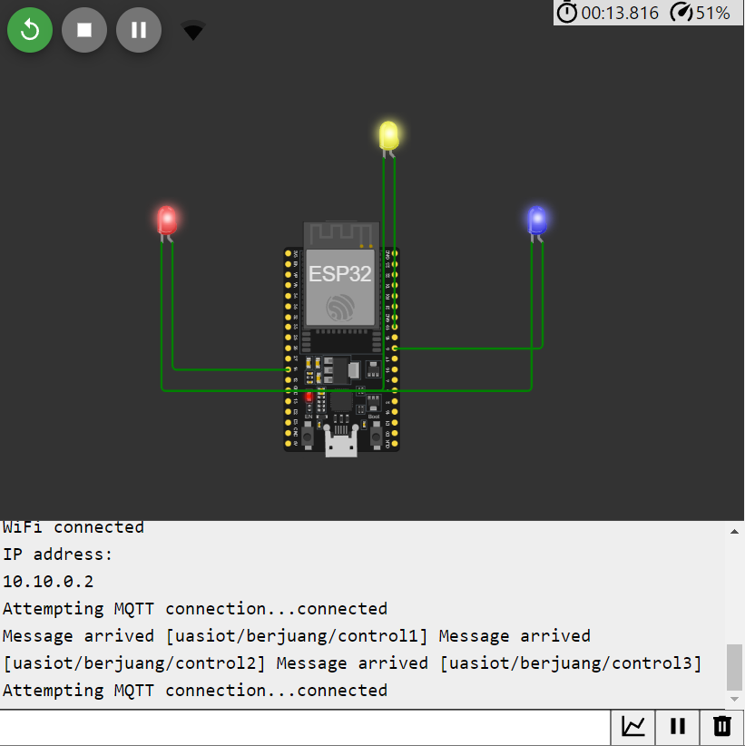

# Pemantauan Suhu, Kelembapan, Kualitas Udara, dan Kontrol LED Menggunakan Kodular dengan Protokol MQTT dan HTTP

<!-- Deskripsi singkat proyek Anda di sini. -->

## Penjelasan Singkat

Dalam kehidupan sehari-hari, kenyamanan di dalam ruangan sangat penting. Faktor-faktor seperti suhu, kelembapan, kualitas udara, dan pencahayaan dari sebuah lampu mempengaruhi kenyamanan dan efisiensi ruangan. Proyek ini bertujuan untuk mengintegrasikan sensor lingkungan dan mengontrol  lampu dalam satu sistem cerdas, memungkinkan pemantauan dan kontrol yang optimal untuk meningkatkan kenyamanan dan efisiensi ruangan.

## Fitur

- **Fitur 1:** Monitoring Suhu, Kelembapan, dan Kualitas Udara melalui Aplikasi Mobile.
- **Fitur 2:** Kontrol LED menggunakan MQTT.

## Dokumentasi

<!-- Berikut adalah beberapa tangkapan layar dari aplikasi: -->

### Diagram Blok

<!--  -->

### Tampilan Aplikasi Mobile

### Hasil Pengujian Monitoring

### Hasil Pengujian Controlling

### Link Video Pengujian
[UAS-IoT-2024](https://youtu.be/3mRyPQj6w78)
